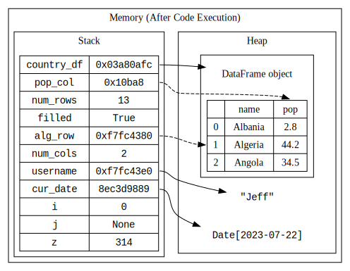

::: {.content-visible unless-format="revealjs"}

<center>
<a class="h2" href="./slides.html" target="_blank">Open slides in new window &rarr;</a>
</center>

:::

# Welcome to DSAN 5500!

# Part 1: Coding in General

## Types of Languages

* Compiled
* Interpreted

## Primitive Types

* Boolean (`True` or `False`)
* Numbers (Integers, Decimals)
* Strings
* `None`

## Stacks and Heaps {.smaller}

Let's look at what happens, in the computer's memory, when we run the following code:

::: columns
::: {.column width="50%"}

```{python}
#| code-fold: show
#| label: py-memory-example
import datetime
import pandas as pd
country_df = pd.read_csv("assets/country_pop.csv")
pop_col = country_df['pop']
num_rows = len(country_df)
filled = all(~pd.isna(country_df))
alg_row = country_df.loc[country_df['name'] == "Algeria"]
num_cols = len(country_df.columns)
username = "Jeff"
cur_date = datetime.datetime.now()
i = 0
j = None
z = 314
country_df
```

:::
::: {.column width="50%"}

<!-- https://kroki.io/graphviz/svg/eNqtU01v2zAMPae_wlAvG5AGkuw0bhELKLovDNsO27BLGgSKJH-0rmTIdtMu8n8fraRZ1xrbZTpYFsn3RD2Sssgsr_IgC7ZHASzL9Y0sbPLpqz8Ko4XSjeWNSr7bVh2N6na9Q4iyrRtl32NAjkYlX6syQZ_VrbEPwauLFFzBpZEqeHuvRNsURr9GEPcCTjz8QPCt4eIG-bufrrq547Ze-KAgCdB2O9f8VmEmTAvpPaxk6ryFsMpUK2FKp9vblTWb2qVFWSrpeJn1Z28Hf-3aWtke4kRrVxJe6Ap37X52bjvnUlrM8D0OeYx5Kpy3ELAQvOaxm6eEkRA2ynpV4CcCXzpLRRTGGI5TRuF7ejCq3jhjsRKhPIvjMzjFrLedsS9G9wQEs5BEXYfGdc4r1T_SKmGsROPU6KZPNEGXprWFsmgJknVDatI_1fygeDUg5gsU3lf_-Tre87zhDX9nIYXArK-VaNBg9D542KmhF2pVJXiCMR2MyPFizzCXmL24clwpvSlkkyd4J1HyKNBymI480kGzZJg5kDujjMA3ZLSvckaYr_9Fuea64LBnysI-zyJ2oTNTch817VvK0UnsomhCXRhNpocy_SWHzltGPpUweMzlCn1UaXqFhqr65IVQ4MM7ogMYNFELiml4gmcnlC7_TTLqDnmh3Qyhc9_cwQkLUI7RucQLGPIaRrzQjZ_x5TCE7CAEnWfTRd08lHCp5HWuoEOfMwTH4_t9zj8KtUEDlGn0m4_-D77Tni8PBzwz74mOQIzuF2xJdsA= -->



:::
:::

# Part 2: Python Specifically

## \#1 Sanity-Preserving Tip!

* (For our purposes) the answer to "what is Python?" is: an **executable file** that **runs `.py` files!**
  * e.g., we can run `python mycode.py` in Terminal/PowerShell

* Everything else: `pip`, Jupyter, Pandas, etc., is an **add-on** to this basic functionality!

## Code Blocks via Indentation

```{python}
#| label: indentation-example
for i in range(5):
    print(i)
```

```{python}
#| label: indentation-2
#| error: true
for i in range(5):
print(i)
```
