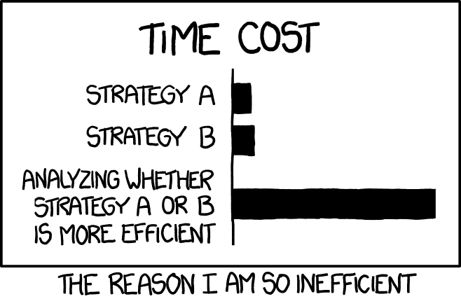

::: {.content-visible unless-format="revealjs"}

<center>
<a class="h2" href="./slides.html" target="_blank">Open slides in new window &rarr;</a>
</center>

:::

# Welcome to DSAN 5500! {data-name="Welcome"}

* Principles for the Course
* Coding in General
* Coding in Python

# Course Principles {data-name="Principles"}

* *Comparative* Understanding
* Learning Data Structures and Complexity *Simultaneously*

## Developing a *Comparative* Understanding {.full-width-callout}

<!-- https://css-tricks.com/left-align-and-right-align-text-on-the-same-line/ -->

::: {.callout-note icon="false" appearance="minimal"}

::: {.container style="width: 100%; clear: both;"}
::: {style="float: left;"}
*"We hardly know ourselves, if we know nobody else"*
:::

::: {style="float: right;"}
--(Blue Scholars, <a href='https://www.youtube.com/watch?v=vbziavrLrds' target='_blank'>"Sagaba"</a>)
:::

:::
:::

* The course focuses on **Python**, but part of understanding Python is understanding how Python **does things differently from other languages!**
* Just as C was "overtaken" by Java, then Java was "overtaken" by Python, Python will someday be overtaken

## The Numbers

```{python}
#| label: plot-langs
#| code-fold: true
import pandas as pd
import numpy as np
import plotly.express as px
import plotly.io as pio
pio.renderers.default = "notebook"
lang_df = pd.read_csv("assets/gh_issues.csv")
# The data for 2022 is essentially useless
lang_df = lang_df[lang_df['year'] <= 2021].copy()
lang_df['time'] = lang_df['year'].astype(str) + "_" + lang_df['quarter'].astype(str)
lang_df['prop'] = lang_df['count'] / lang_df.groupby('time')['count'].transform('sum')
lang_df.head()
#sns.lineplot(data=lang_df, x='year', y='count', color='name')
# Keep only most popular languages
keep_langs = ['Python','JavaScript','C','C++','C#','Java','Ruby']
pop_df = lang_df[lang_df['name'].isin(keep_langs)].copy()
fig = px.line(pop_df,
  x='time', y='prop', color='name',
  template='simple_white', title='Programming Language Popularity Since 2012',
  labels = {
    'time': 'Year',
    'prop': 'Proportion of GitHub Issues'
  }
)
fig.update_layout(
  xaxis = dict(
    tickmode = 'array',
    tickvals = [f"{year}_1" for year in range(2012,2022)],
    ticktext = [f"{year}" for year in range(2012,2022)]
  )
)
fig.show()
```

## Avoid Analysis Paralysis

* *(Easier said than done, admittedly...)*

{fig-align="center"}

## Tie Yourself to the Mast

* The 3am, exhausted, brain-barely-working version of you will thank **present you** for writing useful **exceptions** and **type hints**!

{fig-align="center"}

# Part 1: Coding in General {data-stack-name="Coding"}

## Types of Languages

* Compiled
* Interpreted

## Primitive Types

* Boolean (`True` or `False`)
* Numbers (Integers, Decimals)
* Strings
* `None`

## Stacks and Heaps {.smaller}

Let's look at what happens, in the computer's memory, when we run the following code:

::: columns
::: {.column width="50%"}

```{python}
#| code-fold: show
#| label: py-memory-example
import datetime
import pandas as pd
country_df = pd.read_csv("assets/country_pop.csv")
pop_col = country_df['pop']
num_rows = len(country_df)
filled = all(~pd.isna(country_df))
alg_row = country_df.loc[country_df['name'] == "Algeria"]
num_cols = len(country_df.columns)
username = "Jeff"
cur_date = datetime.datetime.now()
i = 0
j = None
z = 314
country_df
```

:::
::: {.column width="50%"}

<!-- https://kroki.io/graphviz/svg/eNqtU01v2zAMPae_wlAvG5AGkuw0bhELKLovDNsO27BLGgSKJH-0rmTIdtMu8n8fraRZ1xrbZTpYFsn3RD2Sssgsr_IgC7ZHASzL9Y0sbPLpqz8Ko4XSjeWNSr7bVh2N6na9Q4iyrRtl32NAjkYlX6syQZ_VrbEPwauLFFzBpZEqeHuvRNsURr9GEPcCTjz8QPCt4eIG-bufrrq547Ze-KAgCdB2O9f8VmEmTAvpPaxk6ryFsMpUK2FKp9vblTWb2qVFWSrpeJn1Z28Hf-3aWtke4kRrVxJe6Ap37X52bjvnUlrM8D0OeYx5Kpy3ELAQvOaxm6eEkRA2ynpV4CcCXzpLRRTGGI5TRuF7ejCq3jhjsRKhPIvjMzjFrLedsS9G9wQEs5BEXYfGdc4r1T_SKmGsROPU6KZPNEGXprWFsmgJknVDatI_1fygeDUg5gsU3lf_-Tre87zhDX9nIYXArK-VaNBg9D542KmhF2pVJXiCMR2MyPFizzCXmL24clwpvSlkkyd4J1HyKNBymI480kGzZJg5kDujjMA3ZLSvckaYr_9Fuea64LBnysI-zyJ2oTNTch817VvK0UnsomhCXRhNpocy_SWHzltGPpUweMzlCn1UaXqFhqr65IVQ4MM7ogMYNFELiml4gmcnlC7_TTLqDnmh3Qyhc9_cwQkLUI7RucQLGPIaRrzQjZ_x5TCE7CAEnWfTRd08lHCp5HWuoEOfMwTH4_t9zj8KtUEDlGn0m4_-D77Tni8PBzwz74mOQIzuF2xJdsA= -->


:::
:::

# Part 2: Python Specifically {data-stack-name="Python"}

## \#1 Sanity-Preserving Tip!

* (For our purposes) the answer to "what is Python?" is: an **executable file** that **runs `.py` files!**
  * e.g., we can run `python mycode.py` in Terminal/PowerShell

* Everything else: `pip`, Jupyter, Pandas, etc., is an **add-on** to this basic functionality!

## Code Blocks via Indentation

```{python}
#| label: indentation-example
for i in range(5):
    print(i)
```

```{python}
#| label: indentation-2
#| error: true
for i in range(5):
print(i)
```

## Type Hints {.smaller .crunch-title .crunch-ul}

* **Not** a "standard" Python feature, **not** enforced by the Python interpreter, but can help you **maintain sanity**!

::: columns
::: {.column width="50%"}

```{python}
#| label: type-hints
def multiply(thing1, thing2):
  return thing1 * thing2
print(multiply(5, 3))
print(multiply("fiveee", 3))
```

:::
::: {.column width="50%"}

```{python}
#| label: type-hints-safe
from numbers import Number
def multiply(thing1: Number, thing2: Number) -> Number:
  return thing1 * thing2
print(multiply(5, 3))
print(multiply("fiveee", 3))
```

:::
:::

```{python}
from mypy import api
result = api.run(['-c',_i])
print(result[0])
```