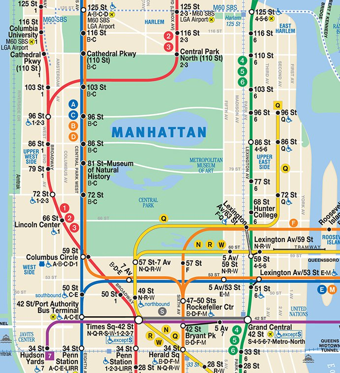
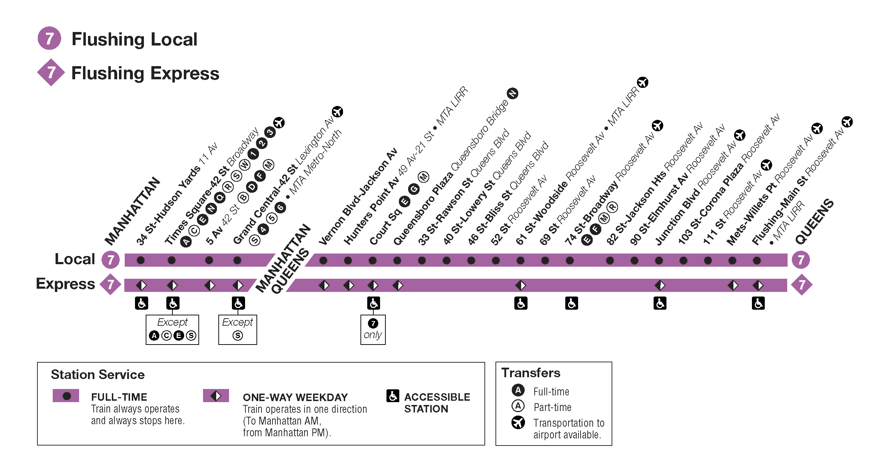
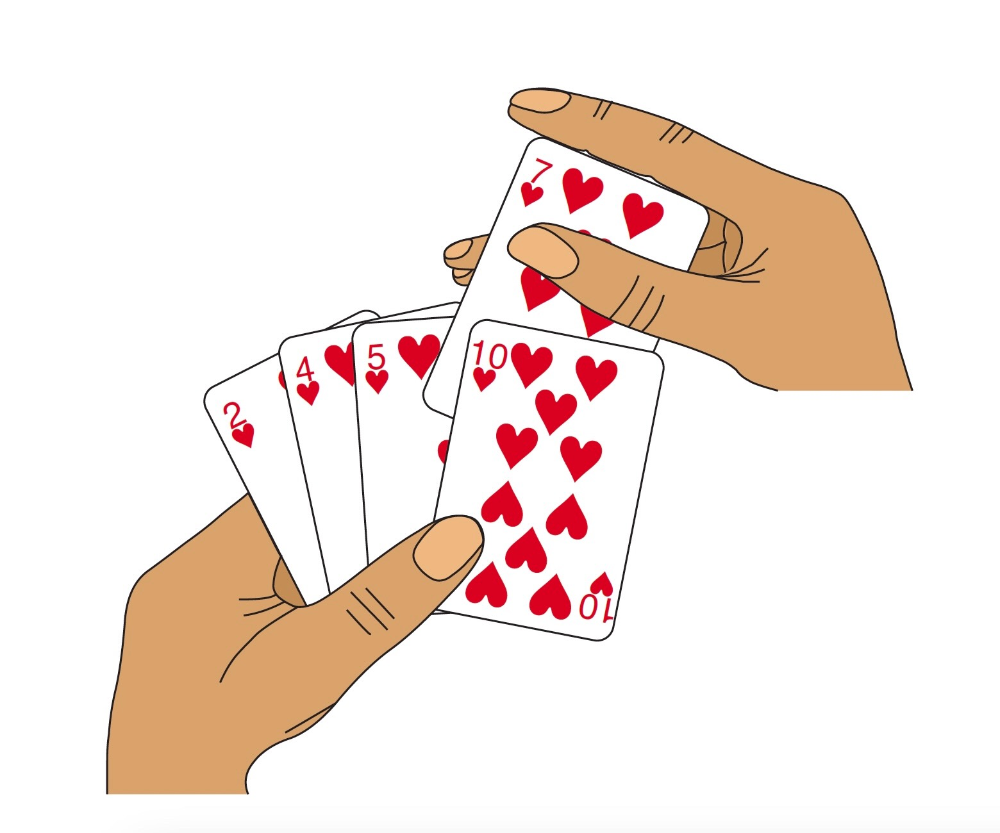

::: {.content-visible unless-format="revealjs"}

<center>
<a class="h2" href="./slides.html" target="_blank">Open slides in new window &rarr;</a>
</center>

:::

# Data Structures: Motivation {data-stack-name="Data Structures"}

## Why Does The NYC Subway Have Express Lines? {.smaller .title-11}

{fig-align="center"}

## Why Stop At Two Levels? {.smaller}

{fig-align="center"}

## How TF Does Google Maps Work? {.smaller .crunch-iframe .crunch-title .crunch-ul}

* A (mostly) full-on answer: soon to come! Data structures for spatial data
* A step in that direction: **Quadtrees**! (**Fractal DC**)

```{=html}
<iframe src="https://jimkang.com/quadtreevis/" width="100%" height="450"></iframe>
```
<a href='https://jimkang.com/quadtreevis/' target='_blank'>Jim Kang's Quadtree Visualizations <i class='bi bi-box-arrow-up-right'></i></a>

# Algorithmic Complexity: Motivation {data-stack-name="Complexity"}

## The Secretly Exciting World of Matrix Multiplication

* Fun Fact 1: Most of modern Machine Learning is, at the processor level, just a bunch of matrix operations
* Fun Fact 2: The way we've all learned how to multiply matrices requires $O(N^3)$ operations, for two $N \times N$ matrices $A$ and $B$
* Fun Fact 3: $\underbrace{x^2 - y^2}_{\mathclap{\times\text{ twice, }\pm\text{ once}}} = \underbrace{(x+y)(x-y)}_{\times\text{once, }\pm\text{ twice}}$
* Fun Fact 4: These are not very fun facts at all

## Why Is Jeff Rambling About Matrix Math From 300 Years Ago? {.smaller}

* The way we all learned it in school (for $N = 2$):

$$
AB = \begin{bmatrix}
a_{11} & a_{12} \\
a_{21} & a_{22}
\end{bmatrix}
\begin{bmatrix}
b_{11} & b_{12} \\
b_{21} & b_{22}
\end{bmatrix} =
\begin{bmatrix}
a_{11}b_{11} + a_{12}b_{21} & a_{11}b_{12} + a_{12}b_{22} \\
a_{21}b_{11} + a_{22}b_{21} & a_{21}b_{12} + a_{22}b_{22}
\end{bmatrix}
$$

* 12 operations: 8 multiplications, 4 additions $\implies O(N^3) = O(2^3) = O(8)$
* Are we trapped? Like... what is there to do besides performing these $N^3$ operations, if we want to multiply two $N \times N$ matrices? Why are we about to move onto yet another slide about this?

## Block-Partitioning Matrices {.smaller}

* Now let's consider **big** matrices, whose dimensions are a power of 2 (for ease of illustration): $A$ and $B$ are now $N \times N = 2^n \times 2^n$ matrices
* We can "decompose" the matrix product $AB$ as:

$$
AB = \begin{bmatrix}
A_{11} & A_{12} \\
A_{21} & A_{22}
\end{bmatrix}
\begin{bmatrix}
B_{11} & B_{12} \\
B_{21} & B_{22}
\end{bmatrix} =
\begin{bmatrix}
A_{11}B_{11} + A_{12}B_{21} & A_{11}B_{12} + A_{12}B_{22} \\
A_{21}B_{11} + A_{22}B_{21} & A_{21}B_{12} + A_{22}B_{22}
\end{bmatrix}
$$

* Which gives us a **recurrence relation** representing the total number of computations required for this big-matrix multiplication: $T(N) = \underbrace{8T(N/2)}_{\text{Multiplications}} + \underbrace{\Theta(1)}_{\text{Additions}}$
* It turns out that (using a method we'll learn in Week 3), given this recurrence relation and our **base case** from the previous slide, this divide-and-conquer approach via block-partitioning doesn't help us: we still get $T(n) = O(n^3)$...
* So why is Jeff still torturing us with this example?

## Time For Some 🪄MATRIX MAGIC!🪄 {.smaller .crunch-title .crunch-ul .crunch-math .crunch-li .title-12}

::: {#matrix-magic-defn}

* If we define

$$
\begin{align*}
m_1 &= (a_{11}+a_{22})(b_{11}+b_{22}) \\
m_2 &= (a_{21}+a_{22})b_{11} \\
m_3 &= a_{11}(b_{12}-b_{22}) \\
m_4 &= a_{22}(b_{21}-b_{11}) \\
m_5 &= (a_{11}+a_{12})b_{22} \\
m_6 &= (a_{21}-a_{11})(b_{11}+b_{12}) \\
m_7 &= (a_{12}-a_{22})(b_{21}+b_{22})
\end{align*}
$$

:::
::: {#matrix-magic-result}

* Then we can combine these **seven** scalar products to obtain our matrix product:

$$
AB = \begin{bmatrix}
m_1 + m_4 - m_5 + m_7 & m_3 + m_5 \\
m_2 + m_4 & m_1 - m_2 + m_3 + m_6
\end{bmatrix}
$$

:::

* Total operations: 7 multiplications, 18 additions

## Block-Partitioned Matrix Magic {.smaller}

* Using the previous slide as our **base case** and applying this same method to the block-paritioned big matrices, we get the same result, but where the four entries in $AB$ here are now **matrices** rather than scalars:

$$
AB = \begin{bmatrix}
M_1 + M_4 - M_5 + M_7 & M_3 + M_5 \\
M_2 + M_4 & M_1 - M_2 + M_3 + M_6
\end{bmatrix}
$$

* We now have a **different recurrence relation**: $T(N) = \underbrace{7T(N/2)}_{\text{Multiplications}} + \underbrace{\Theta(N^2)}_{\text{Additions}}$
* And it turns out, somewhat miraculously, that the additional time required for the **increased number of additions** is **significantly less** than the **time savings** we obtain by doing 7 instead of 8 multiplications, since this method now runs in $T(N) = O(N^{\log_2(7)}) \approx O(N^{2.807}) < O(N^3)$ 🤯

# Sorting {data-stack-name="Sorting"}

* Your first "use case" for both **using a data structure** and **analyzing the complexity** of an operation on it!
* We'll start with simple approach (**insertion sort**), then more complicated approach (**merge sort**)
* Using complexity analysis, we'll see how (much like the matrix-multiplication example) simplest isn't always best D:

## Insertion Sort

* Think of how you might sort a deck of cards in your hand

{fig-align="center"}

## Merge Sort

## Complexity Analysis

# Object-Oriented Programming {data-stack-name="OOP"}

## Breaking a Problem into (Interacting) Parts {.title-08 .crunch-title}

* **Python so far**: "Data science mode"
  * Start at top of file with raw data
  * Write lines of code until problem solved
* **Python in this class**: "Software engineering mode"
  * Break system down into parts
  * Write each part separately
  * Link parts together to create the whole
* *(One implication: `.py` files may be easier than `.ipynb` for development!)*

## How Does A Calculator Work?

{fig-align="center"}

## Key OOP Feature #1: *Encapsulation*

* Imagine you're on a **team** trying to make a calculator
* One person can write the `Screen` class, another person can write the `Button` class, and so on
* Natural division of labor! (May seem silly for a calculator, but imagine as your app **scales up**)

## Use Case: Bookstore Inventory Management {.smaller .title-12}

{fig-align="center"}

## In Pictures {.smaller}

```{dot}
//| label: bookstore-diagram
//| echo: false
digraph G {
	graph [
		label="Bookstore Relational Diagram"
		labelloc="t"
	]
	node [
		shape=record,
        fontname="Courier",
	]
    rankdir=LR

	Bookstore[nojustify=false,label = "Bookstore|Name\l|<loc>Location\l|<bl>Booklist\l|Get_Inventory()\l|Sort_Inventory()\l"]

    Place[label="<placehead>Place|City\l|State\l|Country\l|Print_Map()\l"]

    Bookstore:loc -> Place:placehead[label="Has One"];

    Book[label="<bookhead>Book|<title>Title\l|<auths>Authors\l|Num Pages\l|Preview()"]

    Person[label="<personhead>Person|Family Name|Given Name"]

    Bookstore:bl -> Book:bookhead[label="Has Multiple",style="dashed"]
    Book:auths -> Person:personhead[label="Has Multiple",style="dashed"]
}
```

## Creating Classes {.smaller .crunch-title}

* Use case: Creating an inventory system for a **Bookstore**

::: columns
::: {.column width="50%"}

```{python}
#| label: basic-class
class Bookstore:
    def __init__(self, name, location):
        self.name = name
        self.location = location
        self.books = []

    def __getitem__(self, index):
        return self.books[index]

    def __repr__(self):
        return self.__str__()

    def __str__(self):
        return f"Bookstore[{self.get_num_books()} books]"

    def add_books(self, book_list):
        self.books.extend(book_list)

    def get_books(self):
        return self.books

    def get_inventory(self):
        book_lines = []
        for book_index, book in enumerate(self.get_books()):
            cur_book_line = f"{book_index}. {str(book)}"
            book_lines.append(cur_book_line)
        return "\n".join(book_lines)

    def get_num_books(self):
        return len(self.get_books())

    def sort_books(self, sort_key):
        self.books.sort(key=sort_key)

class Book:
    def __init__(self, title, authors, num_pages):
        self.title = title
        self.authors = authors
        self.num_pages = num_pages

    def __str__(self):
        return f"Book[title={self.get_title()}, authors={self.get_authors()}, pages={self.get_num_pages()}]"

    def get_authors(self):
        return self.authors

    def get_first_author(self):
        return self.authors[0]

    def get_num_pages(self):
        return self.num_pages

    def get_title(self):
        return self.title

class Person:
    def __init__(self, family_name, given_name):
        self.family_name = family_name
        self.given_name = given_name

    def __repr__(self):
        return self.__str__()

    def __str__(self):
        return f"Person[{self.get_family_name()}, {self.get_given_name()}]"

    def get_family_name(self):
        return self.family_name

    def get_given_name(self):
        return self.given_name
```

:::
::: {.column width="50%"}

```{python}
#| label: create-objs
my_bookstore = Bookstore("Bookland", "Washington, DC")
plath = Person("Plath", "Sylvia")
bell_jar = Book("The Bell Jar", [plath], 244)
marx = Person("Marx", "Karl")
engels = Person("Engels", "Friedrich")
manifesto = Book("The Communist Manifesto", [marx, engels], 43)
elster = Person("Elster", "Jon")
cement = Book("The Cement of Society", [elster], 311)
my_bookstore.add_books([bell_jar, manifesto, cement])
print(my_bookstore)
print(my_bookstore[0])
print("Inventory:")
print(my_bookstore.get_inventory())
```

:::
:::

## Doing Things With Classes {.smaller}

* Now we can **use** our OOP structure, for example to sort the inventory in different ways!

::: columns
::: {.column width="50%"}

<center>
**Alphabetical (By First Author)**
</center>

```{python}
#| label: sort-alpha
sort_alpha = lambda x: x.get_first_author().get_family_name()
my_bookstore.sort_books(sort_key = sort_alpha)
print(my_bookstore.get_inventory())
```

:::
::: {.column width="50%"}

<center>
**By Page Count**
</center>

```{python}
#| label: sort-pages
sort_pages = lambda x: x.get_num_pages()
my_bookstore.sort_books(sort_key = sort_pages)
print(my_bookstore.get_inventory())
```

:::
:::

## Key OOP Feature #2: *Polymorphism* {.smaller .crunch-title}

* Encapsulate **general properties** in **parent** class, **specific properties** in **child classes**

![(You can edit this or make your own UML diagrams in <a href='https://www.nomnoml.com/#view/%5B%3Cabstract%3E%20Vehicle%7C%0A%20%20numDoors%3A%20int%3B%20numWheels%3A%20int%3B%20balanced%3A%20bool%3B%7C%0A%20%20turnOn()%3B%20accelerate()%3B%20brake()%3B%20turnOff()%3B%0A%5D%0A%5BMotorcycle%7CnumDoors%20%3D%200%3BnumWheels%20%3D%202%3B%20balanced%20%3D%20false%3B%5D%0A%5B%3Cabstract%3E%20Car%7CnumWheels%20%3D%204%3Bbalanced%20%3D%20true%3B%5D%0A%5BCoupe%7CnumDoors%20%3D%202%3B%5D%0A%5BSedan%7CnumDoors%20%3D%204%3B%5D%0A%5BTruck%7CnumDoors%20%3D%202%3BnumWheels%20%3D%2018%3Bbalanced%20%3D%20true%3B%5D%0A%0A%5BVehicle%5D-%3A%3E%5BMotorcycle%5D%0A%5BVehicle%5D--%3A%3E%5BCar%5D%0A%5BVehicle%5D-%3A%3E%5BTruck%5D%0A%5BCar%5D-%3A%3E%5BCoupe%5D%0A%5BCar%5D-%3A%3E%5BSedan%5D%0A' target='_blank'>nomnoml<i class='bi bi-box-arrow-up-right ps-1'></i></a>!)](images/vehicle-basic.svg){fig-align="center"}

## Or... Is This Better? {.smaller .crunch-title}

![Edit in <a href='https://www.nomnoml.com/#view/%5B%3Cabstract%3E%20Vehicle%7CnumDoors%3A%20int%3BnumWheels%3A%20int%3Bbalanced%3A%20bool%3B%7CturnOn()%3Baccelerate()%3Bbrake()%3BturnOff()%3B%5D%0A%5B%3Cabstract%3E%20UnbalancedVehicle%7Cbalanced%20%3D%20false%3B%5D%0A%5B%3Cabstract%3E%20BalancedVehicle%7Cbalanced%20%3D%20true%3B%5D%0A%5BMotorcycle%7CnumDoors%20%3D%200%3BnumWheels%20%3D%202%3B%5D%0A%5B%3Cabstract%3E%20Car%7CnumWheels%20%3D%204%3B%5D%0A%5BCoupe%7CnumDoors%20%3D%202%3B%5D%0A%5BSedan%7CnumDoors%20%3D%204%3B%5D%0A%5BTruck%7CnumDoors%20%3D%202%3BnumWheels%20%3D%2018%3B%5D%0A%0A%5BVehicle%5D--%3A%3E%5BUnbalancedVehicle%5D%0A%5BUnbalancedVehicle%5D-%3A%3E%5BMotorcycle%5D%0A%5BVehicle%5D--%3A%3E%5BBalancedVehicle%5D%0A%5BBalancedVehicle%5D--%3A%3E%5BCar%5D%0A%5BBalancedVehicle%5D-%3A%3E%5BTruck%5D%0A%5BCar%5D-%3A%3E%5BCoupe%5D%0A%5BCar%5D-%3A%3E%5BSedan%5D%0A' target='_blank'>nomnoml<i class='bi bi-box-arrow-up-right ps-1'></i></a>](images/vehicle-fancy.svg){fig-align="center"}

## Design Choices {.smaller}

* The goal is to **encapsulate** as best as possible: which **objects** should have which **properties**, and which **methods**?
* Example: Fiction vs. Non-Fiction. How important is this distinction **for your use case?**

::: columns
::: {.column width="50%"}

<center>
**Option 1: As Property of `Book`**
</center>

```{python}
#| label: fiction-property
from enum import Enum
class BookType(Enum):
    NONFICTION = 0
    FICTION = 1

class Book:
    def __init__(self, title: str, authors: list[Person], num_pages: int, type: BookType):
        self.title = title
        self.authors = authors
        self.num_pages = num_pages
        self.type = type

    def __str__(self):
        return f"Book[title={self.title}, authors={self.authors}, pages={self.num_pages}, type={self.type}]"
```

```{python}
#| label: use-fiction-property
joyce = Person("Joyce", "James")
ulysses = Book("Ulysses", [joyce], 732, BookType.FICTION)
schelling = Person("Schelling", "Thomas")
micromotives = Book("Micromotives and Macrobehavior", [schelling], 252, BookType.NONFICTION)
print(ulysses)
print(micromotives)
```

:::
::: {.column width="50%"}

<center>
**Option 2: Separate Classes**
</center>

```{python}
#| label: fiction-separate-classes-setup
#| echo: false
class Book:
    def __init__(self, title, authors, num_pages):
        self.title = title
        self.authors = authors
        self.num_pages = num_pages

    def __str__(self):
        return f"Book[title={self.get_title()}, authors={self.get_authors()}, pages={self.get_num_pages()}]"

    def get_authors(self):
        return self.authors

    def get_first_author(self):
        return self.authors[0]

    def get_num_pages(self):
        return self.num_pages

    def get_title(self):
        return self.title
```

```{python}
#| label: fiction-separate-classes
# class Book defined as earlier
class FictionBook(Book):
    def __init__(self, title, authors, num_pages, characters):
        super().__init__(title, authors, num_pages)
        self.characters = characters

class NonfictionBook(Book):
    def __init__(self, title, authors, num_pages, topic):
        super().__init__(title, authors, num_pages)
        self.topic = topic
```

```{python}
#| label: use-fiction-separate-classes
joyce = Person("Joyce", "James")
ulysses = FictionBook("Ulysses", [joyce], 732, ["Daedalus"])
schelling = Person("Schelling", "Thomas")
micromotives = NonfictionBook("Micromotives and Macrobehavior", [schelling], 252, "Economics")
print(ulysses)
print(micromotives)
```

:::
:::

# HW1: Python Fundamentals {data-name="HW1"}

* <a href='https://classroom.google.com/c/NjM5MzE2MTE4NTgx' target='_blank'>Google Classroom <i class='bi bi-box-arrow-up-right ps-1'></i></a>