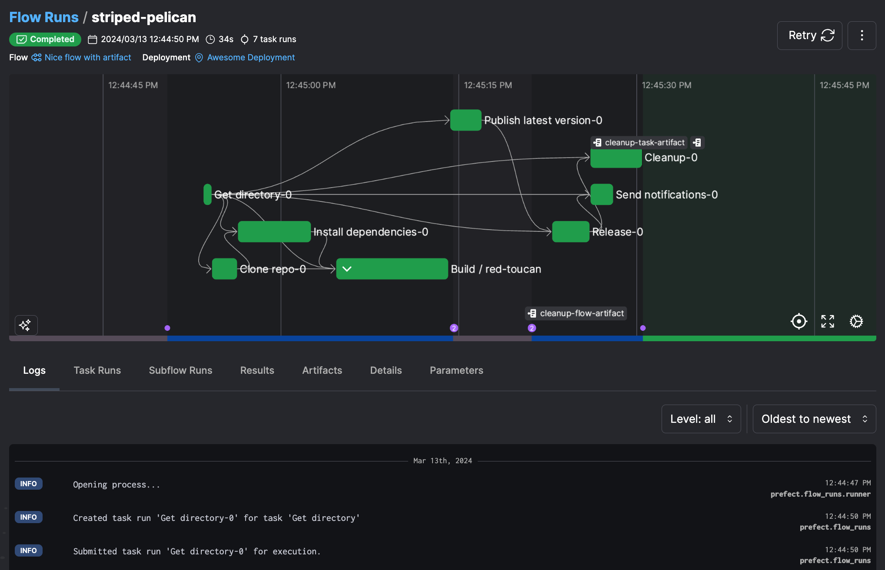
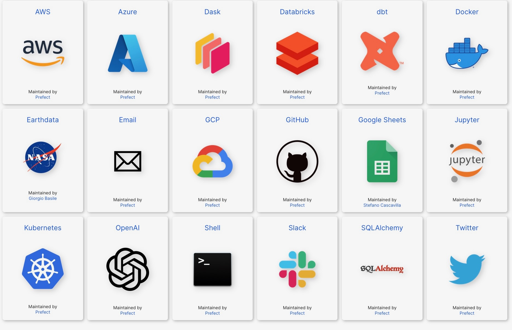
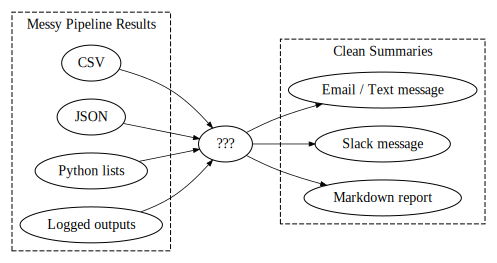

## The Three Main Buzzwords {.crunch-title}

*(Underlined terms link to relevant section of [docs](https://docs.prefect.io/v3/get-started/index))*

* <a class='under' href='https://docs.prefect.io/latest/concepts/flows/' target='_blank'>**`Flow`**</a>: The "main thing" your pipeline is doing!
  * Except in simple cases, will consist of **multiple <a class='under' href='https://docs.prefect.io/latest/concepts/tasks/' target='_blank'>`Tasks`</a>**
* `Flow`s and `Task`s alone already provide much more functionality than "basic" functions...
* <a class='under' href='https://docs.prefect.io/latest/concepts/deployments/' target='_blank'>**`Deployment`s**</a>: `Flow`s + `Task`s + **Metadata** about **how** and **when** you want them to run.
  * "**Deployments** elevate workflows from [functions that you call manually] to [API-managed entities]."

## Deployments $\Rightarrow$ Run Flows Programmatically {.crunch-title .title-11 .smaller}

{fig-align="center"}

# The Power of `Deployment`s (More Next Week) {.smaller .crunch-title .crunch-ul .title-10 data-stack-name="Deployments"}

* "Packaging" code as **`Deployments`** enables <a class='under' href='https://docs.prefect.io/latest/concepts/automations/' target='_blank'>**`Triggers`**</a>:
  * On a particular <a href='https://docs.prefect.io/latest/concepts/schedules/' target='_blank' class='under'>**`Schedules`**</a>: every 4 hours, every day at noon, once per week, etc.
  * When important <a class='under' href='https://docs.prefect.io/latest/concepts/automations/' target='_blank'>**`Events`**</a> happen: **pushes** to GitHub, **addition, removal, modification** of files in Dropbox, etc.
* <a class='under' href='https://docs.prefect.io/latest/guides/logs/' target='_blank'>**`Logging`**</a>, <a class='under' href='https://docs.prefect.io/latest/guides/host/#notifications' target='_blank'>**`Notifications`**</a> (Slack, email, text messages)
* <a class='under' href='https://docs.prefect.io/latest/concepts/results/' target='_blank'>**`Results`**</a> as natural-language explanations (produced by Prefect) or **custom summaries**, called <a class='under' href='https://docs.prefect.io/latest/concepts/artifacts/' target='_blank'>**`Artifacts`**</a>, that you define as part of your flows

## `Schedules` {.smaller .crunch-title .crunch-ul}

* <a class='under' href='https://docs.prefect.io/latest/concepts/schedules/#cron' target='_blank'>**`Cron`**</a>: Full-on scheduling language (used by computers since <a href='https://en.wikipedia.org/wiki/Cron' target='_blank'>1975</a>!)

```bash {filename="crontab.sh"}
# ┌───────────── minute (0–59)
# │ ┌───────────── hour (0–23)
# │ │ ┌───────────── day of the month (1–31)
# │ │ │ ┌───────────── month (1–12)
# │ │ │ │ ┌───────────── day of the week (0–6) (Sunday to Saturday)
# │ │ │ │ │
# │ │ │ │ │
# │ │ │ │ │
# * * * * * <command to execute>
```

::: {.columns}
::: {.column width="35%"}

* <a class='under' href='https://docs.prefect.io/latest/concepts/schedules/#interval' target='_blank'>**`Interval`**</a>

```yaml {filename="my_interval.yml"}
schedule:
  interval: 600
  timezone: America/Chicago
```

:::
::: {.column width="65%"}

* <a class='under' href='https://docs.prefect.io/latest/concepts/schedules/#rrule' target='_blank'>**`RRule`**</a>

```yaml {filename="my_rrule.yml"}
schedule:
  rrule: 'FREQ=WEEKLY;BYDAY=MO,WE,FR;UNTIL=20240730T040000Z'
```

:::
:::

## `Events` {.smaller .crunch-title .crunch-ul}

* These **integrations** are nice, but in reality usually **overkill**: you can just use <a class='under' href='https://docs.prefect.io/latest/guides/webhooks/' target='_blank'>**`Webhooks`**</a>

{fig-align="center"}

## `Logging` {.crunch-title}

* For most non-advanced use cases: literally just put `log_prints=True` as a **parameters** of your `Flow`:

```python {filename="flow_with_logging.py"}
from prefect import task, flow

@task
def my_task():
    print("we're logging print statements from a task")

@flow(log_prints=True)
def my_flow():
    print("we're logging print statements from a flow")
    my_task()
```

## `Notifications` {.crunch-title}

* Actually immensely powerful, because it uses a **templating engine** called <a class='under' href='https://jinja.palletsprojects.com/en/3.1.x/' target='_blank'>**`Jinja`**</a> which is **VERY** worth learning!
* With your brain in **pipeline mode**, think of Jinja as the [?] in:

{fig-align="center"}

<!-- https://edotor.net/?engine=dot?engine=dot#digraph%20G%20%7B%0A%20%20%20%20rankdir%3D%22LR%22%3B%0A%09edge%20%5Bpenwidth%3D0.75%2Carrowsize%3D0.6%5D%0A%20%20%20%20%23%20results%0A%09csv%20%5Blabel%3D%22CSV%22%5D%3B%0A%09json%20%5Blabel%3D%22JSON%22%5D%3B%0A%09pl%20%5Blabel%3D%22Python%20lists%22%5D%3B%0A%20%20%20%20logs%20%5Blabel%3D%22Logged%20outputs%22%5D%3B%0A%20%20%20%20%23%20%3F%0A%20%20%20%20qm%20%5Blabel%3D%22%3F%3F%3F%22%5D%3B%0A%20%20%20%20%23%20summaries%0A%20%20%20%20email%20%5Blabel%3D%22Email%20%2F%20Text%20message%22%5D%0A%20%20%20%20slack%20%5Blabel%3D%22Slack%20message%22%5D%0A%09%23text%20%5Blabel%3D%22Text%20message%22%5D%0A%20%20%20%20reports%20%5Blabel%3D%22Markdown%20report%22%5D%0A%09subgraph%20cluster_G1%20%7B%0A%20%20%20%20%20%20%20%20style%3D%22dashed%22%3B%0A%09%09%09%09label%3D%22Messy%20Pipeline%20Results%22%0A%09%09%09%09csv%3B%0A%09%09%09%09json%3B%0A%09%09%09%09pl%3B%0A%20%20%20%20%20%20%20%20%20%20%20%20%20%20%20%20logs%3B%0A%09%7D%0A%09subgraph%20cluster_G2%20%7B%0A%20%20%20%20%20%20%20%20style%3D%22dashed%22%3B%0A%09%09%09%09label%3D%22Clean%20Summaries%22%0A%09%09%09%09email%3B%0A%20%20%20%20%20%20%20%20%20%20%20%20%20%20%20%20slack%3B%0A%20%20%20%20%20%20%20%20%20%20%20%20%20%20%20%20%23text%3B%0A%20%20%20%20%20%20%20%20%20%20%20%20%20%20%20%20reports%3B%0A%09%7D%0A%20%20%20%20csv%20-%3E%20qm%3B%0A%20%20%20%20json%20-%3E%20qm%3B%0A%20%20%20%20pl%20-%3E%20qm%3B%0A%20%20%20%20logs%20-%3E%20qm%3B%0A%20%20%20%20qm%20-%3E%20email%3B%0A%20%20%20%20qm%20-%3E%20slack%3B%0A%20%20%20%20%23qm%20-%3E%20text%3B%0A%20%20%20%20qm%20-%3E%20reports%3B%0A%7D%0A -->

## `Jinja` Example {.crunch-title .smaller .crunch-hr}

::: {.columns}
::: {.column width="48%"}

```html {filename="homepage.jinja"}
<h3>{{ me['name'] }}'s Favorite Hobbies</h3>
<ul>

  <li>{{ hobby }}</li>

</ul>
```

:::
::: {.column width="4%"}

<center>
<span>+</span>
</center>

:::
::: {.column width="48%"}

```python {filename="render_jinja.py"}
from jinja2 import Template
tmpl = Template('homepage.jinja')
tmpl.render(
    me = {'name': 'Jeff'},
    hobbies = [
        "sleeping",
        "jetski",
        "getting sturdy"
    ]
)
```

:::
:::

<hr>

<center>
&darr;
</center>

<hr>

::: {.columns}
::: {.column width="48%"}

```html {filename="rendered.html"}
<h3>Jeff's Favorite Hobbies</h3>
<ul>
  <li>sleeping</li>
  <li>jetski</li>
  <li>getting sturdy</li>
</ul>
```

:::
::: {.column width="4%"}

$\leadsto$

:::
::: {.column width="48%"}

```{=html}
<h3>Jeff's Favorite Hobbies</h3>
<ul>
  <li>sleeping</li>
  <li>jetski</li>
  <li>getting sturdy</li>
</ul>
```

:::
:::

# Lab Time! {data-name="Lab"}

* <a href='https://colab.research.google.com/drive/1hwBQcam-fGordWAvyEnbyK412CR1CQAV?usp=sharing' target='_blank'>Week 9 Lab: Pipeline Orchestration with Prefect</a>
