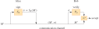

::: {.content-visible unless-format="revealjs"}

<center>
<a class="h2" href="./slides.html" target="_blank">Open slides in new window &rarr;</a>
</center>

:::

# Schedule {.smaller .small-title .crunch-title .crunch-callout .code-90 data-name="Schedule"}

Today's Planned Schedule:

| | Start | End | Topic |
|:- |:- |:- |:- |
| **Lecture** | 6:30pm | 6:50pm | [Key Concepts &rarr;](#key-concepts) |
| | 6:50pm | 7:00pm | [Execution Graphs &rarr;](#deployments-rightarrow-run-flows-programmatically) |
| | 7:00pm | 7:15pm | [Deployments (Preview) &rarr;](#the-power-of-deployments-(more-next-week))
| | 7:15pm | 8:00pm | [Lab Part 1 &rarr;](#lab-time) |
| **Break!** | 8:00pm | 8:10pm | |
| | 8:10pm | 9:00pm | [Lab Part 2 &rarr;](#lab-time) |

: {tbl-colwidths="[12,12,12,64]"}



## Back to BSTs

* For HW2, we provide you with an `InventoryItem` class
* Two instance variables: `item_name` and `price`
* Equivalence relations:
  * `__eq__(other)`, `__ne__(other)`
* **Ordering relations**:
  * `__lt__(other)`, `__le__(other)`, `__gt__(other)`, `__ge__(other)`
* Bonus: `__repr__()` and `__str__()`

# Node Traversal: Computational Tree-Climbing {data-stack-name="Tree Traversal"}

## LLs $\rightarrow$ BSTs: The Hard Part

* When we were working with LinkedLists, we could access all items by just "looping through", from one element to the next, printing as we go along.
* But... for a BinarySearchTree, since our structure can now **branch** as we traverse it... How do we "loop through" a BST?
* **Two fundamentally different ways** to traverse every node in our BST
* "Opposites" of each other, so that one is often extremely efficient and the other extremely inefficient for a given task
* Your job as a data scientist is to **think carefully** about which one is **more efficient** for a given goal!

## Two Ways to Traverse: IRL Version {.smaller .crunch-title .title-12 .crunch-ul .crunch-callout}

* Imagine we're trying to learn about a topic $\tau$ using **Wikipedia**, so we find its article $\tau_0$
* There are two "extremes" in terms of strategies we could follow for learning, given the **contents** of the article as well as the **links** it contains to **other articles** 

::: {.callout-note icon="false" title="<i class='bi bi-info-circle pe-1'></i> Depth-First Search (DFS)" style="margin-bottom: 8px !important;"}

* Open $\tau_0$ and start reading it; When we encounter a **link** we **always click it** and **immediately start reading** the new article.
* If we hit an article with no links (or a dead end/broken link), we finish reading it and click the **back button**, picking up where we left off in the previous article. When we reach the end of $\tau_0$, we're done!

:::

::: {.callout-note icon="false" title="<i class='bi bi-info-circle pe-1'></i> Breadth-First Search (BFS)"}

* Bookmark $\tau_0$ in a folder called **"Level 0 Articles"**; open and start reading it
* When we encounter a **link**, we **put it in a "Level 1 Articles" folder**, but **continue reading $\tau_0$** until we reach the end.
* We then **open all "Level 1 Articles"** in new tabs, placing links we encounter in **these** articles into a **"Level 2 Articles"** folder, that we only start reading once all "Level 1 Articles" are read
* We continue like this, reading "Level 3 Articles" once we're done with "Level 2 Articles", "Level 4 Articles" once we're done with "Level 3 Articles", and so on. (Can you see a sense in which this is the **"opposite"** of DFS?)

:::

* ...Let's try them out! I clicked "Random Article" and got <a href='https://en.wikipedia.org/wiki/Eustache_de_Saint_Pierre' target='_blank'>Eustache de Saint Pierre <i class='bi bi-box-arrow-up-right ps-1'></i></a>

## Two Ways to Traverse: Picture Version {.smaller .crunch-title .crunch-details}

::: {.columns}
::: {.column width="50%"}

```{python}
#| label: viz-bst
#| fig-align: center
#| code-fold: true
from hw2 import LinkedList, InventoryItem, BinarySearchTree, NodeProcessor, IterAlgorithm
bst = BinarySearchTree()
item1 = InventoryItem('Mango', 50)
bst.add(item1)
item2 = InventoryItem('Pickle', 60)
bst.add(item2)
item3 = InventoryItem('Artichoke', 55)
bst.add(item3)
item5 = InventoryItem('Banana', 123)
bst.add(item5)
item6 = InventoryItem('Aardvark', 11)
bst.add(item6)
HTML(visualize(bst))
```

:::
::: {.column width="50%"}

```{python}
print("DFS:")
dfs_processor = NodeProcessor(IterAlgorithm.DEPTH_FIRST)
#print(type(dfs_processor.node_container))
dfs_processor.iterate_over(bst)

print("\nBFS:")
bfs_processor = NodeProcessor(IterAlgorithm.BREADTH_FIRST)
#print(type(bfs_processor.node_container))
bfs_processor.iterate_over(bst)
```

:::
:::

## Two Ways to Traverse: In-Words Version {.smaller .crunch-title .title-12}

1. **Depth-First Search (DFS)**: With this approach, we iterate through the BST by **always taking the left child as the "next" child** until we hit a **leaf node** (which means, we cannot follow this left-child pointer any longer, since a leaf node does not have a left child or a right child!), and only at that point do we **back up** and take the **right children** we skipped.
2. **Breadth-First Search (BFS)**: This is the **"opposite"** of DFS in the sense that we traverse the tree level-by-level, **never moving to the next level of the tree** until we're **sure that we have visited every node on the current level**.

## Two Ways to Traverse: Animated Version {.smaller .crunch-title .title-12}

::: {layout="[1,1]"}

{fig-align="center"}

{fig-align="center"}

:::

## Two Ways to Traverse: Underlying Data Structures Version {.smaller .crunch-title .title-11}

* Now that you have some intuition, you may be thinking that they might require very different code to implement 🤔
* This is where **mathematical-formal linkage** between the two becomes helpful!
* It turns out (and a full-on algorithmic theory course makes you prove) that
* <i class='bi bi-1-circle'></i> **Depth-First Search** can be accomplished by **processing nodes in an order determined by adding each to a *stack***, while
* <i class='bi bi-2-circle'></i> **Breadth-First Search** can be accomplished by **processing nodes in an order determined by adding each to a *queue***!

* $\implies$ Literally **identical code**, "pulling out" the word **stack** and replacing it with the word **queue** within your code (or vice-versa).
* With Software Engineer Hat on, you'll see this as a job for an **abstraction layer!**

## Two Ways to Traverse: HW2 Version

* You'll make a class called `NodeProcessor`, with a **single** `iterate_over(tree)` function
* This function---**without any changes in the code or even any if statements!**---will be capable of both DFS and BFS
* It will take in a `ThingContainer` (could be a **stack** or a **queue**, you won't know which), which has two functions:
  * `put_new_thing_in(new_thing)`
  * `take_existing_thing_out()`

## Three Animals in the DFS Species

| DFS Procedure | Algorithm |
| - | - |
| Pre-Order Traversal | 1. **Print node**<br>2. Traverse left subtree<br>3. Traverse right subtree |
| **In-Order** Traversal 🧐‼️ | 1. Traverse left subtree<br>2. **Print node**<br>3. Traverse right subtree |
| Post-Order Traversal | 1. Traverse left subtree<br>2. Traverse right subtree<br>3. **Print node** |

## The Three Animals Traverse our Inventory Tree {.smaller .crunch-title .title-10}

```{python}
#| fig-align: center
visualize(bst)
```

## Final Notes for HW3

* The last part challenges you to ask: **why stop at a hash based on just the *first* letter of the key?**
* We could just as easily use the first **two** letters:
* `h('AA') = 0`, `h('AB') = 1`, ..., `h('AZ') = 25`,
* `h('BA') = 26`, `h('BB') = 27`, ..., `h('BZ') = 51`,
* `h('CA') = 52`, ..., `h('ZZ') = 675`.
* You will see how this gets us **even closer to the elusive $O(1)$!** And we could get even closer with three letters, four letters, ... 🤔🤔🤔

# Functional Programming (FP){data-stack-name="Functional Programming"}

## Functions vs. Functionals {.crunch-title .crunch-ul .crunch-details .title-09 .crunch-li-8}

* You may have noticed: `map()` and `reduce()` are "meta-functions": functions that **take other functions as inputs**

::: {.columns}
::: {.column width="50%"}

```{python}
#| echo: true
#| code-fold: false
def add_5(num):
  return num + 5
add_5(10)
```

:::
::: {.column width="50%"}

```{python}
#| echo: true
#| code-fold: false
def apply_twice(fn, arg):
  return fn(fn(arg))
apply_twice(add_5, 10)
```

:::
:::

* In Python, functions **can be used as** vars (Hence `lambda`{.python}):

```{python}
#| echo: true
#| code-fold: false
add_5 = lambda num: num + 5
apply_twice(add_5, 10)
```

* This relates to a whole paradigm, "functional programming"! We will use it to approach **encryption**

## Train Your Brain for Functional Approach $\implies$ Master Debugging! {.crunch-title .title-09 .crunch-ul .crunch-blockquote}

* In CS Theory: enables <a href='https://softwarefoundations.cis.upenn.edu/vfa-current/toc.html' target='_blank'>formal proofs of correctness</a>
* In CS practice:

> When a program doesn’t work, each function is an interface point where you can check that the data are correct. You can look at the intermediate inputs and outputs to **quickly isolate the function** that's **responsible for a bug**.<br>(from Python's <a href='https://docs.python.org/3/howto/functional.html#ease-of-debugging-and-testing' target='_blank'>"Functional Programming HowTo"</a>)

## Code $\rightarrow$ Pipelines $\rightarrow$ *Debuggable* Pipelines {.smaller .crunch-title .title-11 .crunch-ul .crunch-p}

<!-- * Imperative ("standard") programming: Code runs line-by-line, from top to bottom -->
* Scenario: Run code, check the output, and... it's wrong 😵 what do you do?
* Usual approach: Read lines one-by-one, figuring out what they do, seeing if something **pops out** that seems wrong; adding comments like `# Convert to lowercase`{.python}

::: {.columns}
::: {.column width="50%"}

* **Easy case**: found typo in punctuation removal code. Fix the error, add comment like `# Remove punctuation`{.python}

    <i class='bi bi-arrow-return-right'></i> **Rule 1** of FP: transform these comments into **function names**

:::
::: {.column width="50%"}

* **Hard case**: Something in `load_text()` modifies a variable that **later on** breaks `remove_punct()` (Called a **side-effect**)

    <i class='bi bi-arrow-return-right'></i> **Rule 2** of FP: **NO SIDE-EFFECTS!**

:::
:::

```{dot}
//| echo: false
//| fig-height: 1
//| fig-cap: "*(Does this way of diagramming a program look familiar?)*"
digraph G {
  rankdir="TB";
	edge [
    penwidth=1.2
    arrowsize=0.85
  ];
  node [
    fontname="Courier"
    shape="plaintext"
  ];
  input[shape="plaintext", label="in.txt"];
  load_text[label=<
<table border="1" cellborder="0">
<tr>
  <td><font point-size="16">load_text</font></td>
</tr>
<tr>
  <td><font face="Arial" point-size="12">(Verb)</font></td>
</tr>
</table>
  >];
  lowercase[label=<
<table border="1" cellborder="0">
<tr>
  <td><font point-size="16">lowercase</font></td>
</tr>
<tr>
  <td><font face="Arial" point-size="12">(Verb)</font></td>
</tr>
</table>
  >];
  remove_punct[label=<
<table border="1" cellborder="0">
<tr>
  <td><font point-size="16">remove_punct</font></td>
</tr>
<tr>
  <td><font face="Arial" point-size="12">(Verb)</font></td>
</tr>
</table>
  >];
  remove_stopwords[label=<
<table border="1" cellborder="0">
<tr>
  <td><font point-size="16">remove_stopwords</font></td>
</tr>
<tr>
  <td><font face="Arial" point-size="12">(Verb)</font></td>
</tr>
</table>
  >];
  output[shape="plaintext", label="out.txt"];

  {
    rank=same;
    input -> load_text;
    load_text -> lowercase[label="🧐 ✅"];
    lowercase -> remove_punct[label="🧐 ✅"];
    remove_punct -> remove_stopwords[label="🧐 ❌❗️"];
    remove_stopwords -> output;
  }
}
```

* **With** side effects: ❌ $\implies$ issue is **somewhere earlier in the chain** 😩🏃‍♂️
* **No** side effects: ❌ $\implies$ issue **must be in `remove_punct()`!!!** 😎 <i class='bi bi-arrow-down'></i>⏱️ = <i class='bi bi-arrow-up'></i>💰

## If It's So Useful, Why Doesn't Everyone Do It? {.smaller .crunch-title .crunch-ul .crunch-p .crunch-quarto-figure .title-10}

* Trapped in **imperative** (sequential) coding mindset: **Path dependency** / QWERTY
* Reason **we** need to start thinking like this is: it's **1000x** harder to debug **parallel code!** So we need to be less ad hoc in how we write+debug, from here on out! 🙇‍♂️🙏

{fig-align="center" width="500"}

::: {.notes}

The title relates to a classic Economics joke (the best kind of joke): "An economist and a CEO are walking down the street, when the CEO points at the ground and tells the economist, 'look! A $20 bill on the ground!' The economist keeps on walking, scoffing at the CEO: 'don't be silly, if there was a $20 bill on the ground, somebody would have picked it up already'."

:::

# Cryptographic Algorithms {data-stack-name="Cryptography"}

* RSA
* Elliptic-Curve Cryptography

## The RSA Algorithm {.crunch-title .title-12}

> The RSA public-key cryptosystem relies on the dramatic difference between the ease of finding large prime numbers and the difficulty of factoring the product of two large prime numbers [@cormen_introduction_2001, §31.7]

{fig-align="center"}

## Task 1: *Encrypting* a Message {.crunch-title .title-09}

* Public Keys $P_A$ and Secret Keys $S_A$ are **inverses**:

$$
\begin{aligned}
M &= S_A(P_A(M)) \\
M &= P_A(S_A(M))
\end{aligned}
$$

* Alice, and only Alice, is able to compute the function $S_ A(\cdot)$ in any practical amount of time!
* **Bob $\overset{M}{\rightarrow}$ Alice**: Bob computes $C = P_A(M)$ and sends $C$ to Alice; Alice obtains $M$ via $S_A(C) = S_A(P_A(M)) = M$

## Task 2: *Signing* a Message! {.crunch-title .title-09}

* Alice computes her digital signature $\sigma = S_A(M')$, then sends the **pair** $(M', \sigma)$ $\rightarrow$ Bob
* When Bob receives $(M', \sigma)$, he verifies that it originated from Alice by using Alice's public key to check $M' = P_A(\sigma)$

{fig-align="center"}

## So How Do $P_A$ and $S_A$ Work?

* <i class='bi bi-1-circle'></i> Pick two big prime numbers $p$ and $q$, compute $n = pq$
* <i class='bi bi-2-circle'></i> Pick a small odd int $e$ relatively prime to $(p-1)(q-1)$
* <i class='bi bi-3-circle'></i> Find $d$ such that $de \equiv 1\text{ mod }{n}$
* <i class='bi bi-4-circle'></i> Your **public key** is $P = (e,n)$
* <i class='bi bi-5-circle'></i> Your **secret key** is $S = (d,n)$
* Encrypt: $P(M) = M^e \text{ mod }{n}$; Decrypt: $S(C) = C^d \text{ mod }{n}$
* Works because $P(S(M)) = S(P(M)) = M^{ed} \overset{\small{*}}{=} M$

## Why Algorithmic Complexity Matters Here! {.title-08 .crunch-title .crunch-blockquote}

> The security of the RSA cryptosystem rests in large part on the **difficulty of factoring large integers**.

> If an adversary can factor the modulus $n$ in a public key, they can derive the secret key from the public key, using the knowledge of the factors $p$ and $q$ in the same way that the creator of the public key used them.

> Therefore, **if factoring large integers is easy, then breaking the RSA cryptosystem is easy.**

> The converse statement, that if factoring large integers is hard, then breaking RSA is hard, is **unproven** ($P \overset{\smash{\small{?}}}{\small{=}} NP$)

## References

