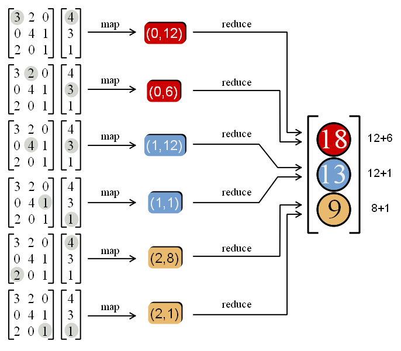

::: {.content-visible unless-format="revealjs"}

<center>
<a class="h2" href="./slides.html" target="_blank">Open slides in new window &rarr;</a>
</center>

:::

# Making Final Projects Less Scary!

## How Do I Pick A Topic?

* I know that "whatever is interesting to you" can be way overly-vague!
* So, one approach is: imagine yourself in a job interview for your dream job, and they bring up DSAN 5450: "Interesting, what did you do in that class?" 
* [Insert final project elevator pitch] "Wow, that's such a cool project, we really want someone who can [say] take a data-driven approach to a policy question like that. You're hired!"
* (Jeff gets a commission: 10% of your salary)

## Getting From Here to There

```{=html}
<style>
.honk-honk {
  font-size: 180% !important;
  /* font-family: "Bungee Spice", sans-serif; */
  font-family: "Honk", sans-serif;
  /* font-optical-sizing: auto; */
  font-weight: 400;
  font-style: normal;
}
</style>
```

* [**Minimum Viable Product**]{.honk-honk} (**MVP**) 
* $\leadsto$ Final Product (but... Hofstadter's Law)

::: {.callout-note title="<i class='bi bi-info-circle pe-1'></i> Hofstadter's Law (Paraphrase)" icon="false"}

The pieces of your DSAN final project will take longer than you expect, even if you take Hofstadter's Law into account

:::

## Interactive Data Structures / Algorithms

* A good number of yall are interested in **visualizing** or allowing **interaction with** the structures/algorithms from class
* One quick way to allow this: **Streamlit!**
* However, Streamlit's "default" is *form*-based interaction (form in sidebar $\rightarrow$ results in main panel); a bit more work required to make **everything** interactive
* (Demo to see what I mean!)

## HW4 Possibility 1

* Map-Reduced **Matrix-Vector Multiplication**

{fig-align="center"}

## HW4 Possibility 2 (More Likely?)

* Scrape quotes **in parallel!**
* Advantage: Builds on HW3
* Disadvantage: Embarrassingly parallel, so... no Map-Reduce coding practice
* (Probable tiebreaker: If you're interested in Map-Reduce, do **Matrix Multiplication** as **Final Project!**)

## References

::: {#refs}
:::
